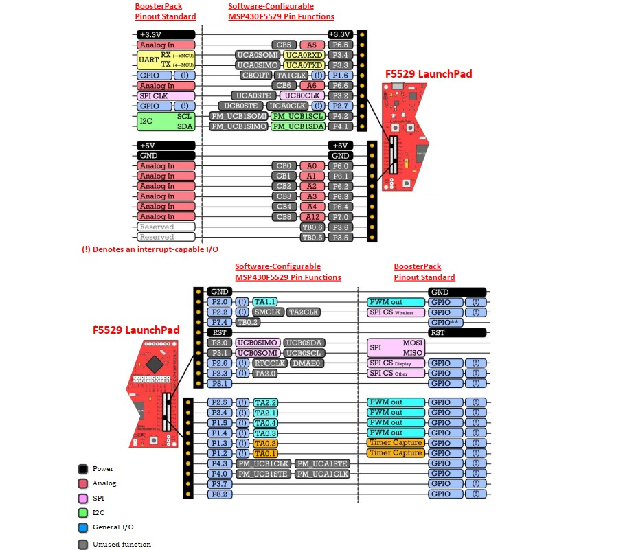

# MSP430 快速入门

## 1. IO

### 1.1

1.I/O 方向设定寄存器 PxDIR，I/O 相应位置 1 表示该引脚为输出模式，置 0 表示该引脚为输入模式，与 32 的 GPIO*Mode*有着部分类似效果；

2.输入设定寄存器 PxIN，控制输入引脚的高低电平；

3.I/O 输出寄存器 PxOUT，控制输出引脚的高低电平；

4.上/下拉电阻使能寄存器 PxREN，控制输出输入引脚的上拉/下拉/推挽模式；PxSEL 功能选择寄存器，声明该端口要用做外围电路特殊功能，与端口复用有关。

5.输出驱动能力设置寄存器 PxDS，默认低电平，置高后可设置为全力驱动，因为 MSP430 系列主打低功耗，引脚的驱动能力在默认情况下是不能驱动一些功率较大的负载的。




## 2. 外部中断

外部中断是 5529 中断优先级最低的中断，其中 P1 和 P2 都可做外部中断的中断源，而 P1.0 的中断优先级在外部中断里是最优的，外部中断可通过以下几个寄存器进行设置：

1.PxIE 中断使能寄存 相应位置 1 表示允许中断；

2.PxIES 中断触发方式寄存器，置 1 表示下降沿触发，置 0 表示上升沿触发；

3.PxIFG 中断标志，由于 MSP430 的中断使能需要使能总中断，所以仅当总中断 GIE 和中断使能寄存器 PxIE 都打开后，PxIFG 高电平表示有中断请求等待待响应，等中断服务函数结束时需要软件清该标志位；

4.PxIV 中断向量表（字），P1 端口的中断函数入口地址应该都放在里面，只是一个地址；

下面是 P2.1 做为外部中断的初始化函数，P2.1 引脚默认为板载按键，需要说明的是，使能中断需要开启全局中断，开启方式见下方例程

```c
/*中断初始化函数*/
void(exti_init)
{
        P2IE |= BIT1;                   //P2.1中断使能
        P2IES |= BIT1;                  //设置为下降沿触发
        P2IFG &= ~BIT1;                 //清中断标志位
        P2REN |=  BIT1;                 //上拉电阻
        P2OUT |=  BIT1;                 //初始化置高
        __enable_interrupt();          //使能中断，也可写做_BIS_SR(GIE);
}
/*中断服务函数*/
#pragma vector=PORT2_VECTOR
__interrupt void P2_ISR(void)
{
    if(P2IFG & BIT1)                        //判断是否有中断挂起
        {
        /*在这里写你的中断服务函数*/
        }
    P2IFG &=~BIT1;                          //清空中断标志

}
```
