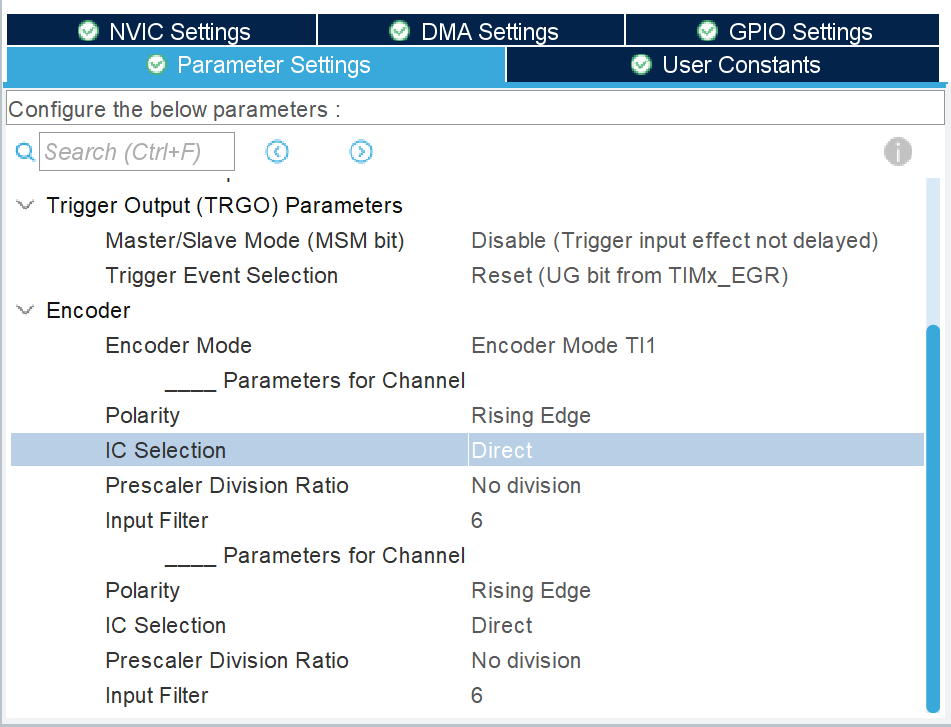

# EC11 模块化代码

```c
/_通道对应更改_/
__HAL_TIM_CLEAR_IT(&htim3,TIM_IT_UPDATE);
HAL_TIM_Encoder_Start(&htim3,TIM_CHANNEL_1 );
__HAL_TIM_ENABLE_IT(&htim3,TIM_IT_UPDATE);

/_主程序或定时器添加下列语句_/
encoder_val = __HAL_TIM_GET_COUNTER(&htim3) / 2; // 获取编码器值
```




