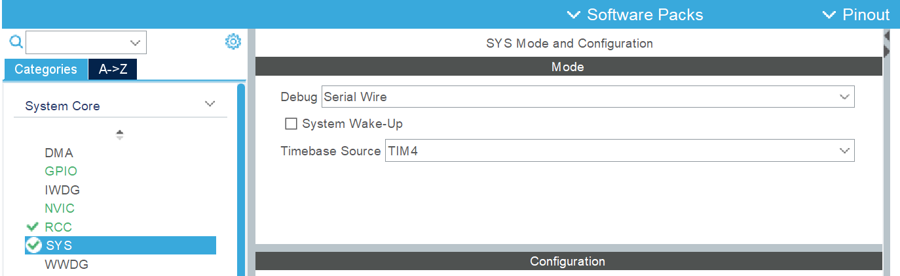
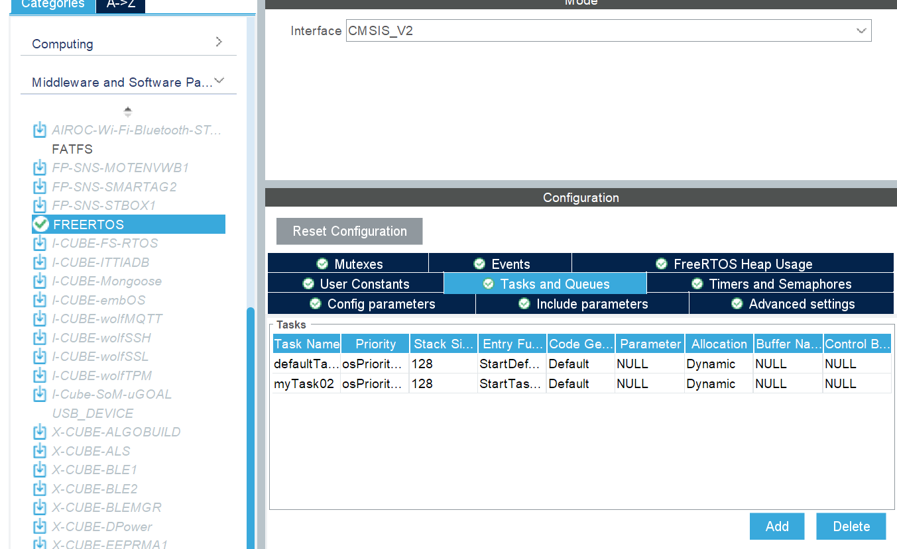
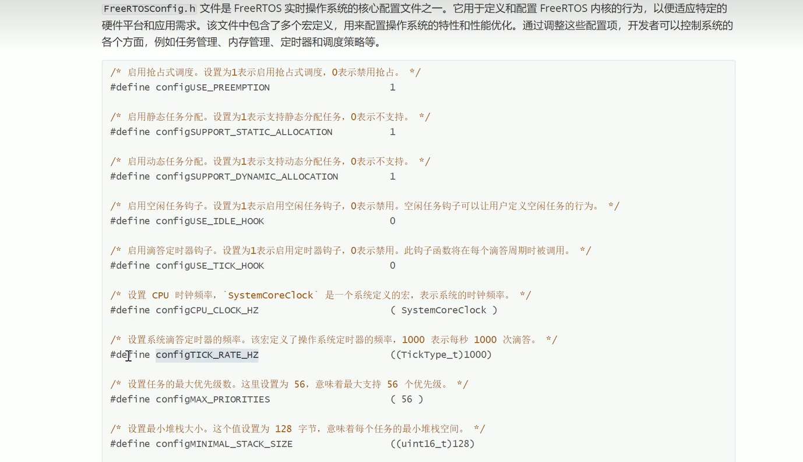
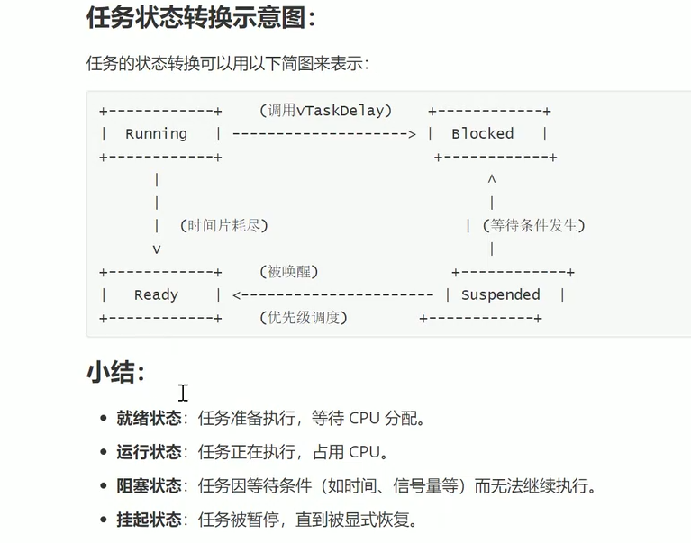

# FreeRTOS HAL 语句函数

## 1. cube 配置注意事项

### 1.1. 配置时钟把 systick 配置为其他时钟源

若存在 no_file 报错，可以把版本调为 1.8.5


### 1.2. 配置时钟把 systick 配置为其他时钟源



### 1.3. 配置 FreeRTOS 并且选择新建任务



## 2. FreeRTOS 语句

### 2.1. 配置文件



### 2.2. 任务状态



### 2.3. 空闲函数的钩子函数

```c
#define configUSE_IDLE_HOOK 1

void vApplicationIdleHook( void )
{
    printf("vApplicationIdleHook\r\n");
}
```
